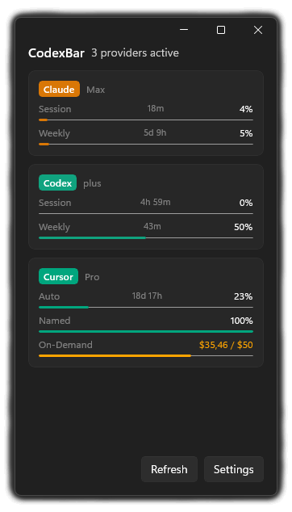

# CodexBar for Windows

Windows port of [CodexBar](https://github.com/steipete/CodexBar), a macOS menu bar app for tracking AI coding assistant usage limits.

A system tray app that displays your session and weekly usage for AI coding tools.

## Providers

| Provider | Status | Authentication |
|----------|--------|----------------|
| Cursor   | Tested | Browser cookies |
| Claude   | Tested | OAuth or browser cookies |
| Codex    | Tested | OAuth or browser cookies |
| Copilot  | Coming soon | GitHub device flow |
| Gemini   | Coming soon | CLI OAuth |
| JetBrains | Coming soon | Local IDE config |
| Augment  | Coming soon | Browser cookies |

## Install

Download the latest release from [GitHub Releases](https://github.com/drdraxi/CodexBar-winui/releases).

**Requirements:** Windows 10 or later

## Build from source

1. Clone the repository
2. Open `src/CodexBar/CodexBar.sln` in Visual Studio 2022
3. Build and run the CodexBar project

Requires .NET 8 SDK and Windows App SDK.

## License

MIT - Original project by [Peter Steinberger](https://github.com/steipete)
